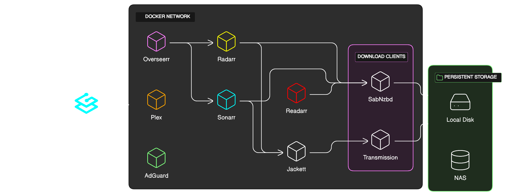

# htpc

A HTPC stack built with docker-compose

## Why it exists

I got tired of managing multiple HTPC apps. With Docker and Docker Compose, it's easier than ever to create a complete stack or migrate an existing one to a new server.

## Overview



## Installation and first run

Clone this depository and run those commands:

```bash
cd htpc/
docker-compose up -d
```

## Before you start

Before you start all the applications, you need ton configure some settings inside the `.env` file in the htpc directory:

- `DVOL` is where the data (tv shows, movies, etc.) will be stored
- `CVOL` is where the config files will be stored
- `TZ` is the timezone
- `PUID` and `PGID` are the user id and group id. Most of the time 1000 is ok here. The folders and files created by the containers will use this UID and GID.

```
PUID=1000
PGID=1000
TZ="America/Toronto"
DVOL=C:\Users\rtlefrancois\Downloads\test\data
CVOL=C:\Users\rtlefrancois\Downloads\test\config
```
